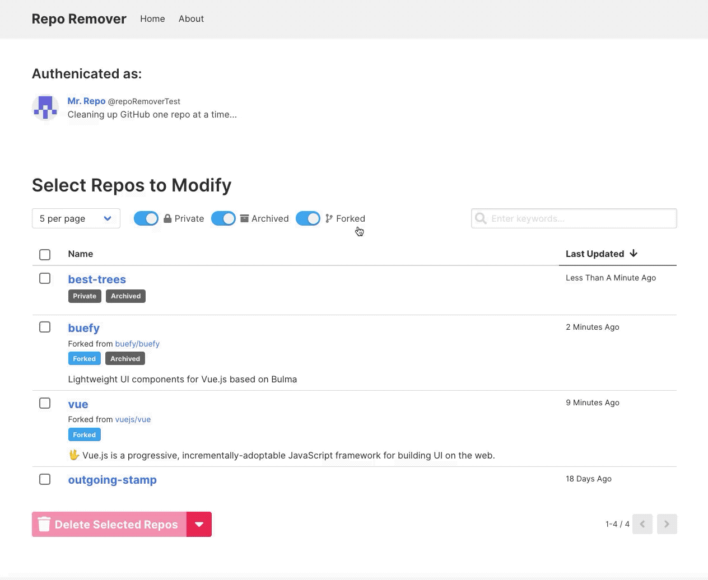

<div align="center">
  <h1>
    
  </h1>
  <p>
    
    <a href="https://reporemover.xyz">
      
    </a>
    <a title="MadeWithVueJs.com Shield" href="https://madewithvuejs.com/p/repo-remover/shield-link">
      
    </a>
  </p>
</div>

## Try it out
**Visit https://reporemover.xyz to get started.**  
*Alternatively, you can fork this project, and run RepoRemover locally using the instructions below.*

## Demo


## How it works
In order to use Repo Remover, a [Personal Access Token](https://help.github.com/en/articles/creating-a-personal-access-token-for-the-command-line) is required. The token is used with the GitHub API to get a list of your personal repositories, and make changes to them.

Once you've provided a Personal Access Token, you can select which of your repos to modify, set the selected repos to be either archived or deleted, and then click the button to make the changes!

Before any changes are made, you will be asked to review the list of selected repos, and confirm your decision.

**Note**: Personal Access Tokens are not stored or saved in any way. For optimal security, we suggest you create a new token each time you use Repo Remover, and delete it when you are done.

------

## Run locally

1. Fork this repository to your own GitHub account and then clone it to your computer.
2. Install dependencies
    ```
    yarn install
    ```
3. Run local server
    ```
    yarn serve
    ```
4. Visit http://localhost:8080/

## Built with
- [Vue.js](https://vuejs.org/)
- [Buefy](https://buefy.org/)
- [Vue-Apollo](https://vue-apollo.netlify.com/)
- Free hosting from [ZEIT Now](https://zeit.co/home)
- Privacy-focused analytics by [Fathom Analytics](https://usefathom.com/ref/E83PFO)

## Author
Zaahir Moolla ([@zmoolla](https://twitter.com/zmoolla), [zaahir.ca](https://zaahir.ca))
